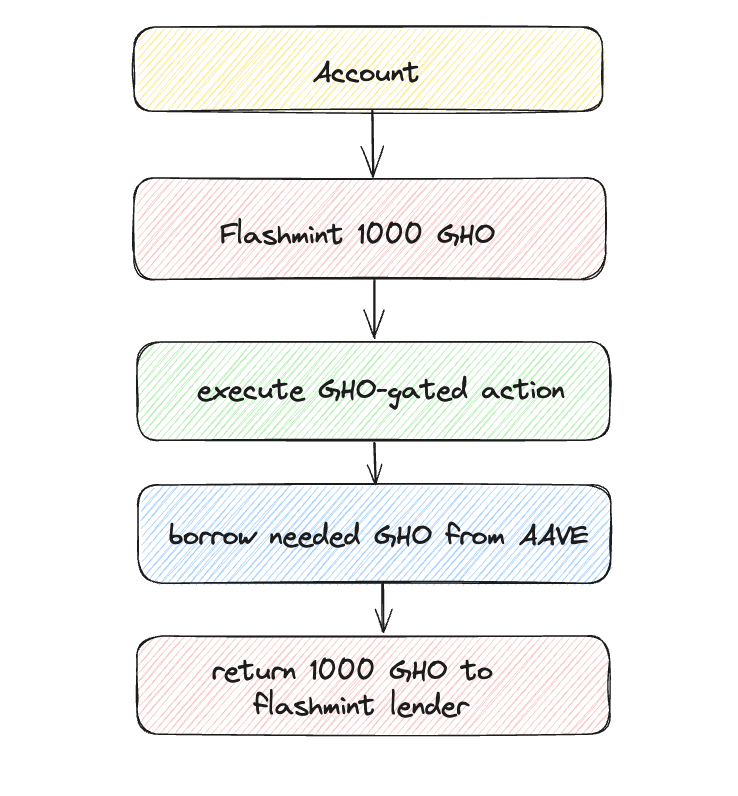
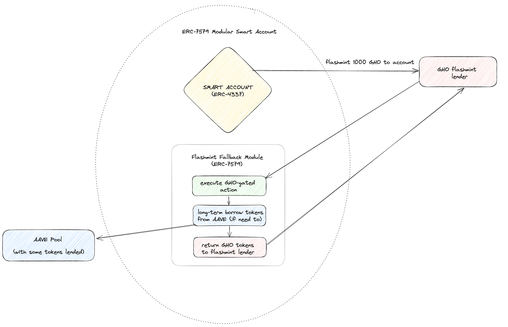
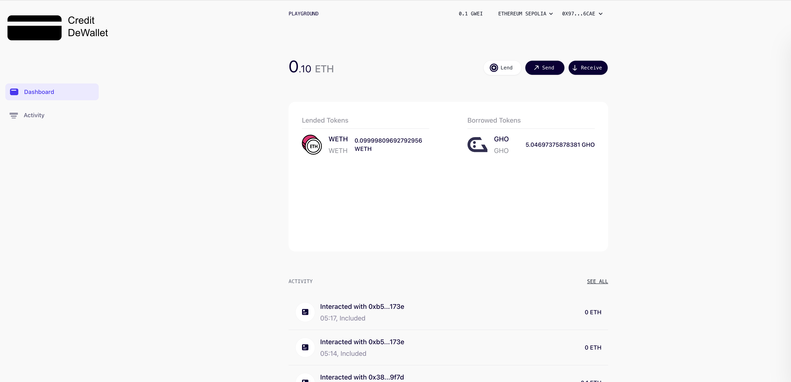

# Credit Card DeWallet

## Motivation

Some users might lack an ability to take loans for their transactions in ERC-20 **token**. We present a solution for users, who can borrow the **token** from Lending Pool.

> Example: Alice wants to transfer 10 GHO to Bob. She has 1 ETH in Lending Pool, but 0 GHO tokens at her balance.

## Problem

For general transaction it might be hard to estimate, how many ERC-20 tokens should be borrowed for successful execution.

One might propose simulation the transaction on-chain before the actual call, which would add a lot of gas overhead and also would require additional security concerns.

## Solution

In a signle transaction, account might `flashLoan` the amount of token, which would be enough for any reasonable transaction execution.

In order to return the flashloan, the long-term borrow of token from Lending Pool will occur.

> Example: Alice wants to transfer 10 GHO to Bob. She has 1 ETH in Lending Pool, but 0 GHO tokens at her balance. She would flashloan 1000 GHO tokens, pay 10 GHO's to Bob. Now she needs to borrow 10 tokens from AAVE in order to repay flashloan

## Repository
There are two submodules in repository:
### flashcall-module-erc7579

This repository has implementation of ERC-7579 compatible **Flashmint Fallback Module**.

This contract should be installed as an *executor module* for Smart Account.

It implements ERC-7579 `IFallbackMethod` interface, and acts as a handler for `IERC3156FlashLender.onFlashLoan` callback to smart account.

Callback handling workflow:

1. Execute action passed with `calldata` argument on behalf of account
2. Borrow `amount+fee - token.balanceOf(account)` from AAVE pool, in order to repay flashloan
3. Repay flashloan.

We use [rhinestonewtf/modulekit](https://github.com/rhinestonewtf/modulekit) library for module implementation.

### modulekit-ui-playground

Our modifications:
- *New button*: Lend token from account to AAVE 
- Send token transaction is wrapped into `flashLoan` call to take loan in GHO
- Lended Tokens List
- Borrowed Tokens List

Forked from [rhinestonewtf/modulekit-ui-playground](https://github.com/rhinestonewtf/modulekit-ui-playground)